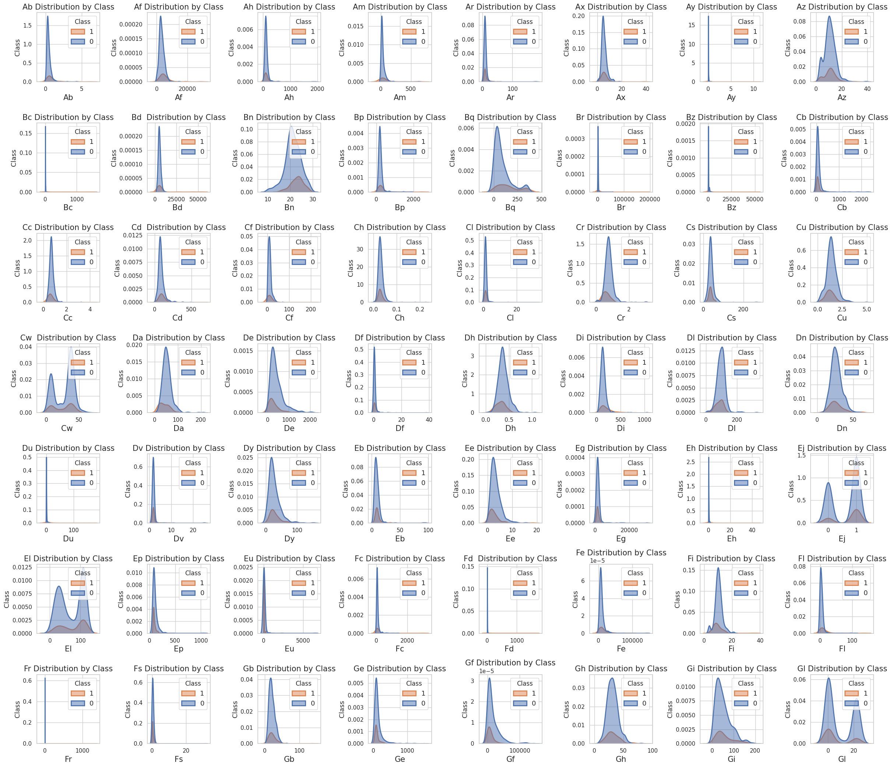
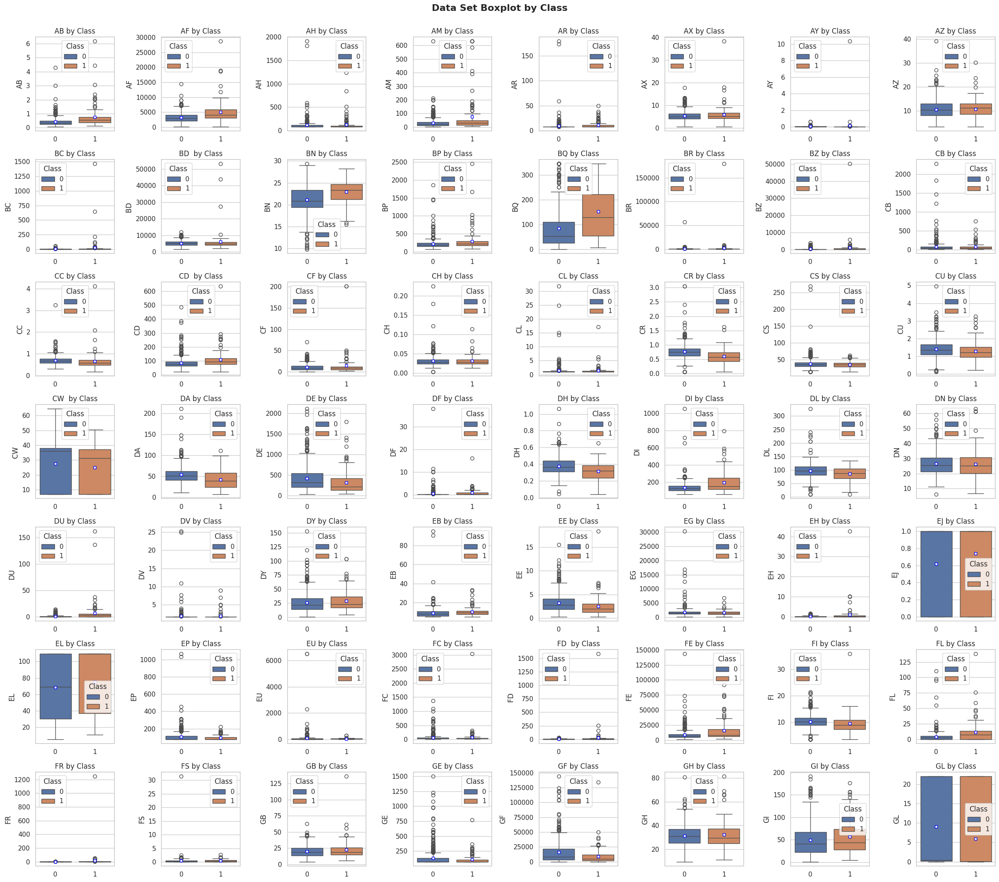
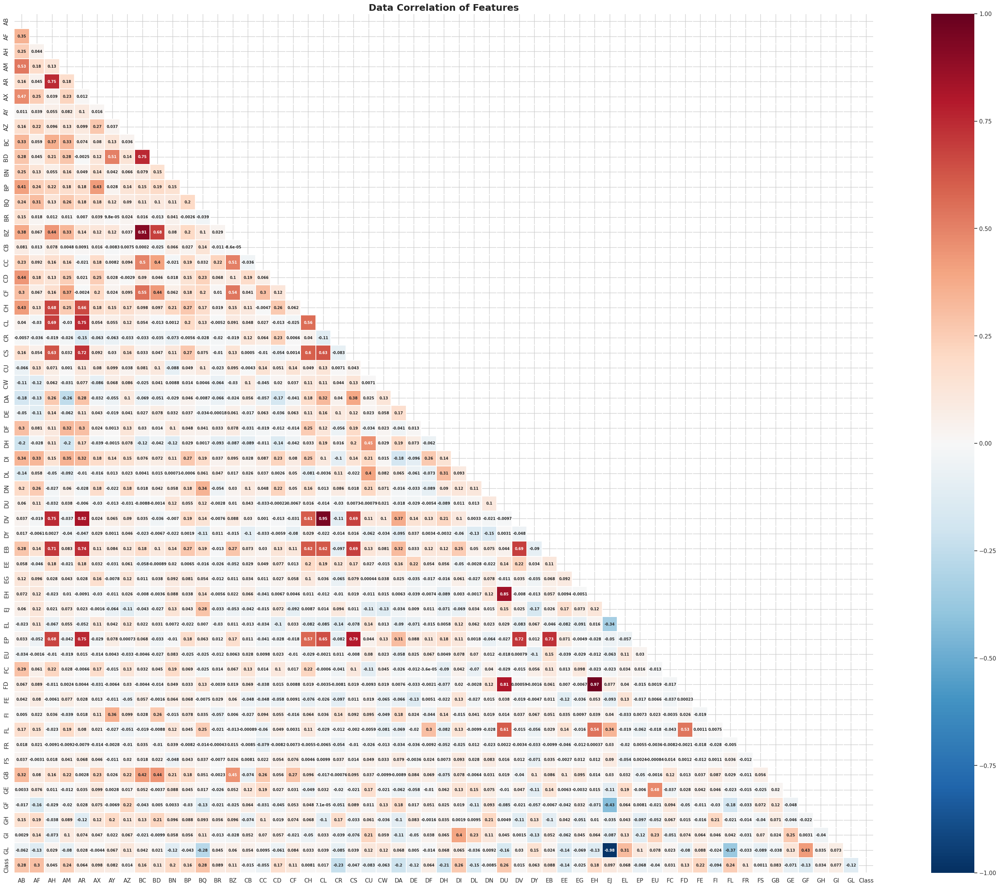
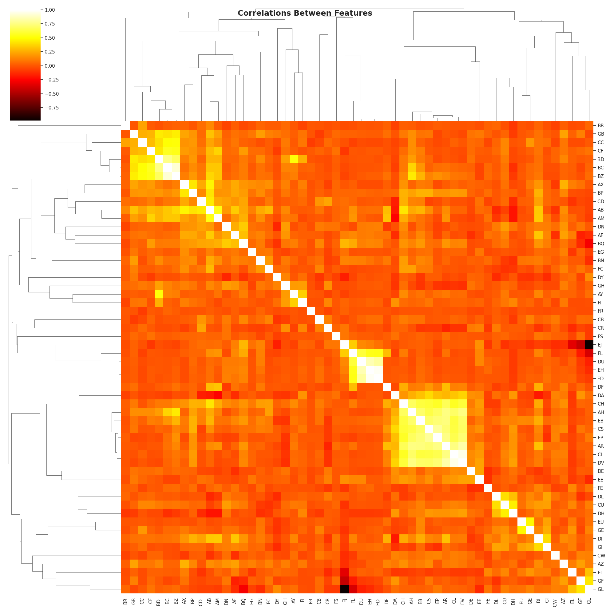

# Kaggle: ICR
**Kaggle Competition | ICR** - Identifying Age-Related Conditions

## OverView

### 대회소개
- 주어진 조건으로 환자가 3가지 노화관련 질병에 해당 되는지 예측.
- 3가지 질병 중 하나 이상을 가지고 있는지(Class 1) 또는 아무 질병도 가지고 있지 않는지(Class 0)로 구분 (이진 분류 문제)

### 배경
- 나이는 숫자에 불과하다는 말이 있지만, 노화와 함께 수많은 건강 문제가 발생합니다. 심장병과 치매에서 청력 상실과 관절염에 이르기까지, 노화는 수많은 질병과 합병증의 위험 요소입니다. 생물정보학 분야는 생물학적 노화를 늦추거나 되돌리고 주요 노화 관련 질병을 예방하는 데 도움이 될 수 있는 개입에 대한 연구를 포함하여 성장하고 있습니다. 데이터 과학은 샘플 수가 적더라도 다양한 데이터로 문제를 해결할 수 있는 새로운 방법을 개발하는 데 중요한 역할을 할 수 있습니다.

- 현재 건강상태를 예측하는 데 XGBoost나 랜덤포레스트와 같은 모델이 사용되고 있지만, 그 성능이 충분하지 않습니다. 생명이 달린 중요한 문제를 다루기 위해서는 모델이 다양한 사례에 대해 안정적이고 일관되게 정확한 예측을 내려야 합니다.

**참여기간**: 23.06.19 ~ 23.07.05

**참여방식**: 개인

 

## 데이터

**input:** 56개 건강 특성 (anonymized health characteristics)

- **Train.csv**: 학습용 데이터. Id, 의료정보가 담긴 features, class의 열로 구성되어 있습니다.
    - `Id` 각 관측값에 대하여 식별하는 고유 ID입니다.
    - `AB-GL` 익명화된 56개의 건강 특성. categorical인 `EJ`를 제외하고 모두 숫자입니다.
    - `class` binary target : `1`은 피험자가 세 가지 조건 중 하나로 진단받았음을 나타내고, `0`은 진단받지 않았음을 나타냅니다.
    - EJ 컬럼은 categorical, 나머지는 모두 numeric 데이터
    - BQ와 EL의 결측치가 60개, 그 외 7개의 컬럼에는 각 1~3개의 결측치가 있음.

- **Test.csv**: 피험자가 두 `class` 각각에 속할 확률을 예측하는 것 입니다. Id와 의료정보가 담긴 features로 구성되어 있습니다.

- **greeks.csv**: 학습용 데이터에만 사용 가능한 보조 metadata.
    - `Alpha` : 노화 여부 코드로 조건이 있는 경우 해당 유형을 식별합니다.
        - `A` : 노화 관련 조건이 없습니다. class `0`에 해당합니다.
        - `B, D, G` : 3가지 실험적 특징 experimental characteristics. class `1`에 해당합니다.
    - `Beta`, `Gamma`, `Delta` : 세 가지 실험 특성입니다.    
    - `Epsilon` : 이 피험자에 대한 데이터가 수집된 날짜입니다. 테스트 세트의 모든 데이터는 훈련 세트가 수집된 후에 수집되었습니다. 결측치는 없지만, Epsilon컬럼 중 ‘Unknown’이 144개 존재합니다.

**output:** 진단 여부 (3가지 중 하나 이상 = class 1, or not = class 0)
- **sample_of_submission.csv** : 제출용 형식의 파일

 

## 평가지표
**Balanced logarithmic loss**

$$ Log\ Loss = \frac{-\frac{1}{N_0}\Sigma_{i=1}^{N_0}y_{0i}\log{p_{0i}}-\frac{1}{N_1}\Sigma_{i=1}^{N_1}y_{1i}\log{p_{1i}}}{2} $$

- 환자와 비 환자의 Logloss을 각각 계산하여 그 값의 평균을 반환.
- Logloss는 다른 평가지표와 비교했을 때, 우연히 정답을 맞추는 것을 방지하기 위하여 틀린 값에 대해 페널티를 줌.
- 해당 대회의 학습train 데이터에서 타겟(Class 0, 1) 데이터가 균등하게 분포되지 않아 데이터 더 많은 Class로 예측하게 되는 문제가 있으며, 이를 보정할 수 있는 Balanced logloss로 평가.

 

## 탐색적 데이터분석 EDA

## 피쳐엔지니어링

## 모델선정 및 훈련

## 한계 점

## 결과

